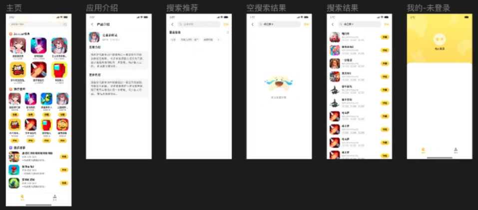

# 小游戏APP

## 概览图

## 需求⽂档

### 闪屏⻚
1. ⽤⼾第⼀次启动app时显⽰隐私内容，点击同意并使⽤，进⼊app⾸⻚，点击不同意，退出app
2. ⽤⼾协议和隐私协议，点击弹出Toast"查看⽤⼾协议"、"查看隐私协议"

### 搜索⻚⾯
3. 进⼊搜索⻚⾯，⾸先进⼊第⼀个⻚⾯
4. 没有搜索记录，最近搜素整个模块都不显⽰
5. 点击删除按钮，删除所有搜索记录
6. 搜索记录保存在本地，最多显⽰30条数据，每条数据超过15个字，显⽰...；
7. 搜索框默认写⼀个游戏名称，游戏名称和⾸⻚⼀致
8. 点击搜索记录，进⾏搜索
9. 搜索结果⻚有数据时显⽰列表⻚，⽀持下拉刷新、上拉加载数据；⽆数据时，显⽰暂⽆搜索结果
10. 游戏点击Item点击，跳转到产品介绍⻚
11. 点击返回按钮，回到上级⻚⾯
